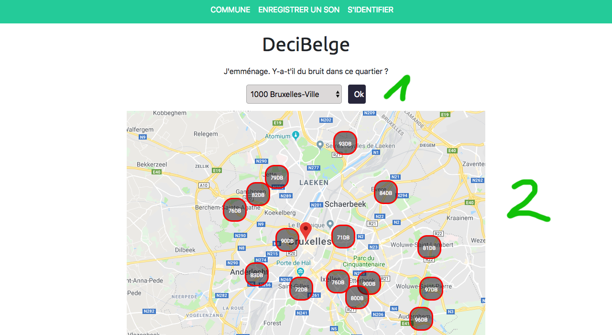
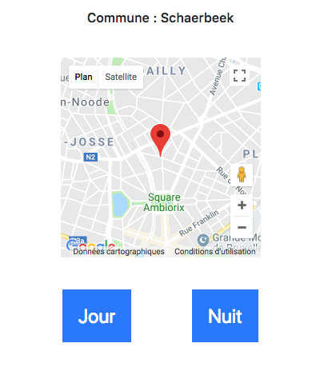
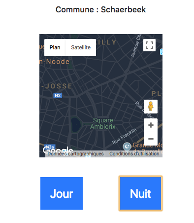
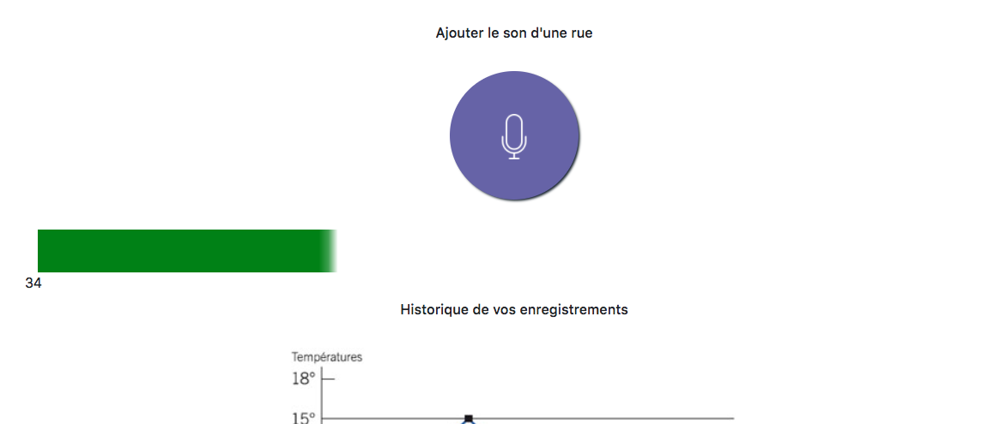

# hackathon

Hackoustic hackathon powered by Cirb_Cibg_Bric, Brussels Smart City and BeCode !

## Sujet de l'hackathon

Le bruit dans la ville.

# Notre idée : DéciBelge

Les participants :

- Quentin Claes
- Stéphane Dethy
- Nicolas Jamar
- Maxime Collin
- Marie Thielens

## Lien vers le site de notre projet :

https://mariethielens.github.io/hakaton/

### Introduction 

Selon une étude de Bruxelles-Environnement, la pollution sonore est la deuxième plus grosse source de nuisances. Le bruit en ville serait même la première cause de déménagement.

Une personne sur cinq trouve même que son habitation se trouve dans un environnement trop bruyant. Une véritable question de santé publique, puisque le bruit, même à faible intensité, a des effets néfastes. "Des effets cardio-vasculaires, de stress, de fatigue, d’insomnie, des difficultés d’apprentissage, de concentration…"

#### Un site et une application

Aider le citoyen à choisir un quartier où le volume sonore lui convient.

##### Page d'accueil

L'utilisateur choisi une commune de prédilection et est redirigé vers la page avec la carte choisie. Cette carte affichera les lieux où il y a le plus de bruit.

##### Page commune

- L'utilisateur à la possibilité de choisir une carte de jour ou de nuit. En fonction du moment où il cherche à avoir de la tranquilité.

##### Enregistrer un son et enrichir la base de donnée

- Grace au micro l'utilisateur à la possibilité d'enregistrer le son d'une rue. Le volume sonore est enregistré en décibel. 
- L'utilisateur doit être géolocalisé

##### Financement

Chercher à faire un partenaria avec immoweb ou avec des particuliers qui s'occupe de l'isolation sonore etc...
